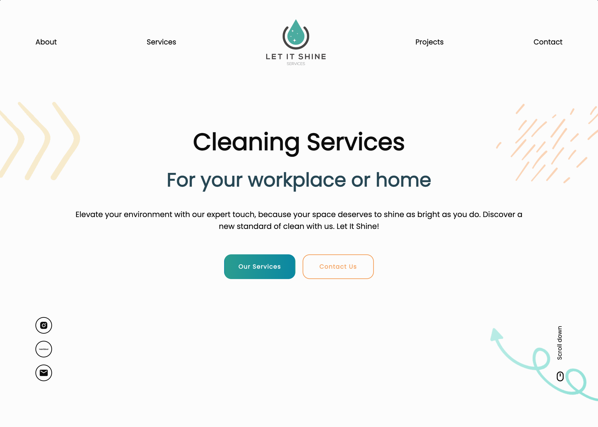
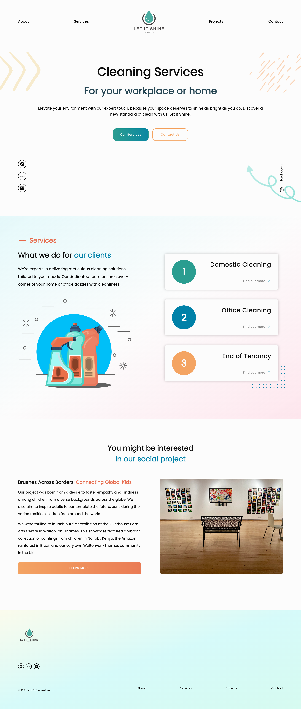

## Table of contents

- [Overview](#overview)
- [Screenshot](#screenshot)
- [Link](#links)
- [Built with](#built-with)
- [Author](#author)

## Overview

This repository contains the code for the Let It Shine Services website, a professional cleaning company. The website features the following pages:

- **Landing Page**: Introduces Let It Shine Services, showcasing the company’s mission and values while providing links to various sections of the site.

- **About Page**: Provides information about the company's history, mission, and values behind Let It Shine Services.

- **Services Page**: Details the range of cleaning services offered to clients, including both residential and commercial options.

- **Projects Page**: Highlights the social projects and community initiatives supported by Let It Shine Services.

- **Contact Page**: Includes a form for visitors to ask questions, provide feedback, or request a quote.

## Screenshot

## Link

- Live Site URL: [Follow this link](https://theletitshine.co.uk/)

## Built with

- React
- React Router

## Author

- Website - [Rodrigo de Lascio](https://rodrigodelascio.co.uk/)
- GitHub - [@rodrigodelascio](https://github.com/rodrigodelascio)
- LinkedIn - [@rodrigodelascio](https://www.linkedin.com/in/rodrigo-de-lascio/)
