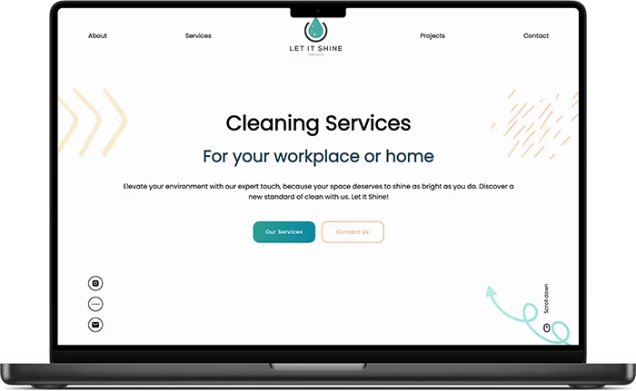
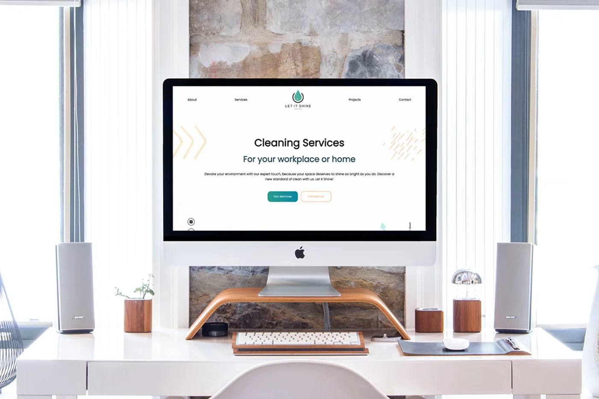
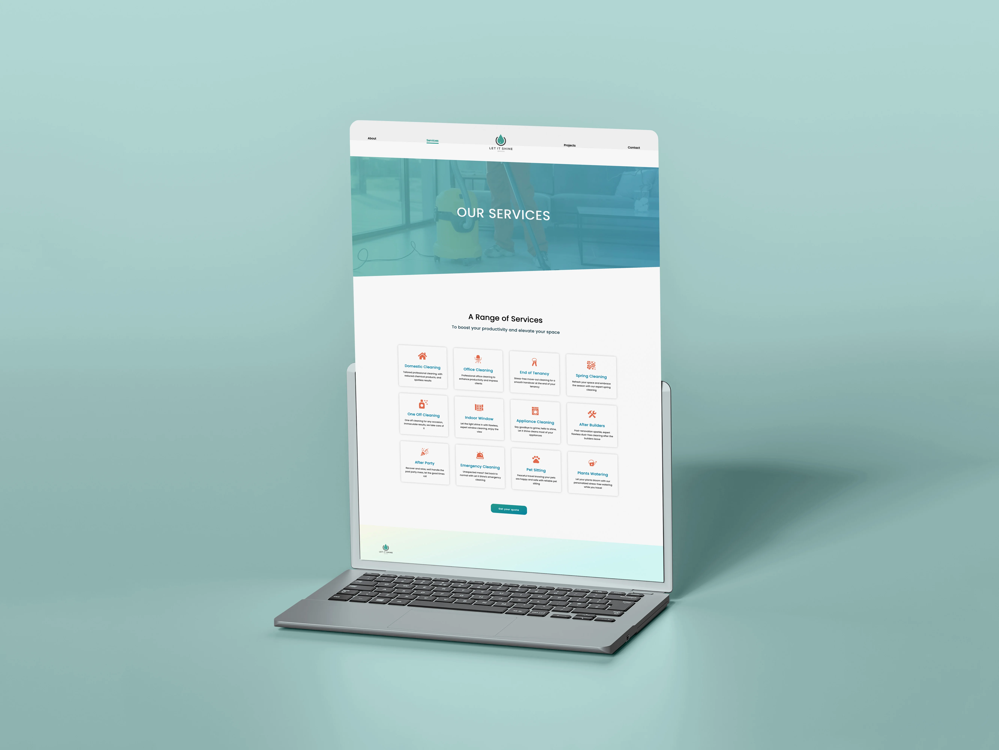
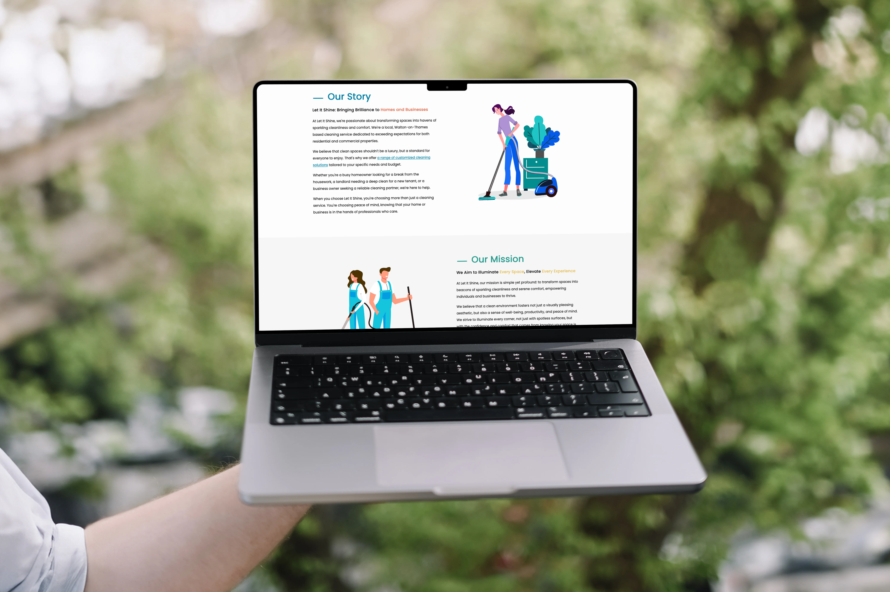

# Let It Shine Services – Business Website

---

## Table of contents

- [Overview](#overview)
- [Project goals](#project-goals)
- [Key features](#key-features)
- [Technical overview](#technical-overview)
- [Screenshots](#screenshots)
- [Live site](#live-site)
- [Built with](#built-with)
- [Author](#author)

---

## Overview

This repository contains the source code for the **Let It Shine Services** website, a professional cleaning company operating in the UK.  
The website was designed and developed for a **real client** and is currently live and in active use.

The primary purpose of the site is to establish a clear online presence for the business, communicate services and values effectively, and provide an easy way for potential customers to make contact or request a quote. The project focuses on clarity, performance, accessibility, and maintainability rather than experimental features or heavy frameworks.

---

## Project goals

The main objectives of this project were:

- Deliver a clean, professional, and trustworthy web presence for a service-based business
- Clearly communicate services, values, and community involvement
- Ensure good performance and responsiveness across devices
- Provide a maintainable codebase suitable for long-term updates
- Deploy a production-ready site for a real client, not a demo

---

## Key features

- Responsive landing page introducing the business and its values
- Dedicated pages for:
  - Company background and mission
  - Services offered (residential and commercial)
  - Social and community projects
  - Contact and enquiry form
- Client-focused content structure and clear calls to action
- Mobile-first layout and accessible navigation
- Deployed and maintained as a live production site

---

## Technical overview

The application is implemented as a **single-page React application** with client-side routing. The structure is intentionally simple and readable, reflecting the requirements of a small business website rather than a complex data-driven system.

Routing is handled on the client to provide smooth navigation between pages without full reloads. Components are organised by responsibility, allowing future changes to content or layout without extensive refactoring.

This project demonstrates practical front-end development for a real-world client scenario, including requirements gathering, content structuring, deployment, and ongoing maintenance.

---

## Screenshots

- Landing page
  

- Services page
  

- About page
  

---

## Live site

- **Live URL**:  
  https://let-it-shine.co.uk/

---

## Built with

- React
- React Router
- HTML5
- CSS3

---

## Author

- Website: https://rodrigodelascio.co.uk/
- GitHub: https://github.com/rodrigodelascio
- LinkedIn: https://www.linkedin.com/in/rodrigo-de-lascio/
